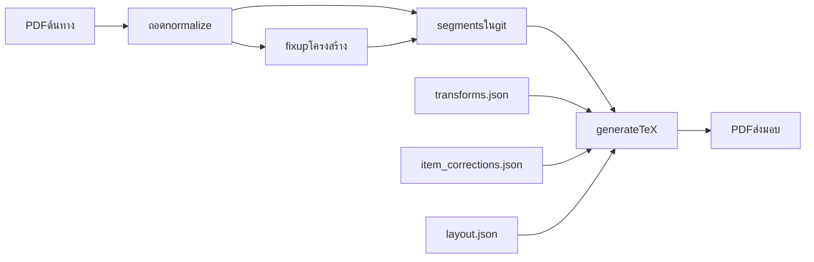

# เป้าหมายและกระบวนการงานหนังสือ (CS Roman)

ประเด็นสื่อสารสำหรับทิศทางขั้นต่อไป ไม่ใช่คู่มืองานประจำ  
งานประจำ: [`playbook.md`](playbook.md) · นโยบายห้ามแก้ segments: [`transliteration_policy.md`](transliteration_policy.md)

## งานนี้อยู่ที่ไหน

`books/` เป็นโต๊ะทำหนังสือทีละฉบับ ไม่ใช่คลังข้อความของเว็บ และยังไม่ได้นำเข้า `archive`

ตอนนี้มีฉบับเดียว: **CS Roman** (Chaṭṭha Saṅgāyana โรมัน 40 เล่ม `01Vin01` … `40Abhi12`) ชุดเดียวกับแคตตาล็อกเว็บ `ch/pali2552ro` แต่คนละชั้นงาน

ในนโยบายองค์กร งานนี้รองรับเป้าหมายที่ ๑ (คลังฉบับอ้างอิง) เป็นแหล่งข้อความคุณภาพสูงของฉบับหนึ่ง ยุทธศาสตร์กำหนดลำดับ Identity → Corpus → Alignment → Service การเชื่อมผลผลิตเข้าคลังกลางเป็นระยะถัดไป (`mastermind/roadmap.md` ระยะ ๓) ห้ามข้ามไปบริการ AI ก่อนรากฐานพร้อม

## เป้าหมายที่กำลังทำ

1. **ถอด PDF ต้นทางให้เป็นโครงสร้างซ้ำได้** — segments ตามสัญญาใน [`SCHEMA.md`](../SCHEMA.md) ไม่ใช่ข้อความที่แก้มือทีละจุด
2. **พิมพ์หนังสือไทยจากโรมัน** สองโหมด: `sync` (หน้าตรงต้นฉบับ) และ `printing` (165×230 มม. ไหลต่อเนื่อง มี `ฉ.N` ที่เปลี่ยนหน้าต้นทาง)
3. **ซื่อสัตย์ต่อหลักฐาน** — คงคำพิมพ์เมื่อต้องการอรรถ (`annotate` ลงท้าย ` – ม.พ.ป.`) แก้โรมันเมื่อฉบับพิมพ์ผิด (`replace`) แก้เลขข้อ Tipiṭaka เป็นชั้นตัวตน (`item_corrections`) ไม่ยุบทุกอย่างให้เป็นข้อความชุดเดียวใน JSON
4. **กฎฉบับพิมพ์อยู่ที่เดียวทั้ง 40 เล่ม** — ไม่กระจายใน `segments.json` รายเล่ม
5. **เกณฑ์รับงานคือ PDF หลัง generate** — `segments.json` เป็นชั้นถอด (extract-normalized) ไม่ใช่ฉบับพิมพ์สุดท้าย

## สิ่งที่สร้างไว้แล้ว (อย่าทำซ้ำจากศูนย์)

- พายไลน์ครบ: ถอด → fixup + ประตู residual → หัวเรื่อง → generate TeX → LuaLaTeX
- สัญญาข้อมูล `schema_version` 1 (segments/layout) และแคตตาล็อก transforms รุ่น 2
- แคตตาล็อกกลาง: [`transforms.json`](../shared/transforms.json) (ตัวสะกด/อรรถ/ตัวหนา) และ [`item_corrections.json`](../shared/item_corrections.json) (เลขข้อ)
- กระบวนการซ่อม JSON เก่าใน [`fixup_manifest.json`](../scripts/fixup_manifest.json) + [`fixup_process.md`](fixup_process.md)
- คู่มืองานประจำ [`playbook.md`](playbook.md) และนโยบายห้ามแก้ segments [`transliteration_policy.md`](transliteration_policy.md)
- งานวิจัยสะสมเรื่องปริวรรต คำควบกล้ำ ยัติภังค์ สมาสขึ้นบรรทัด หัวเรื่องกำพร้า เชิงอรรถ — เก็บที่ `research/` ไม่ใช่ขั้นตอนปกติ

## กระบวนการ: ห้ามปนชั้น

| ชั้น | แก้ที่ | ใช้เมื่อ |
|------|--------|----------|
| ถอดซ้ำได้ | extract + ทดสอบ แล้ว `pipeline.ps1` | PDF ต้นทางผิดแบบเดิมทุกครั้งที่ถอด |
| โครงสร้าง JSON เก่า | `fixup_*.py` ใน manifest | artifact ค้างจากบั๊กที่แก้ที่ต้นทางแล้ว |
| โรมัน / วรรคตอน / อรรถ / ตัวหนา | `shared/transforms.json` | ข้อความฉบับพิมพ์ควรเป็นอะไร |
| เลขข้อ Tipiṭaka | `shared/item_corrections.json` | พิมพ์สลับหลัก ฯลฯ |
| จังหวะหน้า | `volumes/<id>/data/layout.json` | บังคับขึ้นหน้า / ระยะ |
| มหภาคตัวพิมพ์ | `shared/style/` | ไม่แก้ `body.*.generated.tex` |
| สมาสขึ้นบรรทัด | `sandhi_breaks_overrides.json` | ตัดคำตอนขึ้นบรรทัด |
| ตรวจหลัง PDF | `scan_*` ใน `post_pdf_audits` | คุณภาพหน้า — คนละประตูกับ residual JSON |

**ห้าม:** แก้ `output/` หรือ `volumes/…/data/segments.json` ด้วยมือเพื่อแก้ตัวสะกด ปริวรรต โรมันฉบับพิมพ์ หรือเลขข้อ — จะหายเมื่อถอดใหม่ และทำให้ 40 เล่มไม่สอดคล้องกัน

## วงจรงานประจำ

ผู้ใช้แจ้ง **เล่ม + อะไรผิด** → จำแนกชั้น → ค้นคำ (`scan_transform_hits.py`) → แก้ไฟล์ที่ถูก → ทดสอบโมดูลนั้น → สร้าง PDF เฉพาะเล่มที่โดน → ตรวจหน้าใน PDF

หลักยั่งยืนที่ใช้แล้วและต้องรักษา: แก้ที่ต้นเหตุที่ทำซ้ำได้ + regression test + สคริปต์ซ่อม artifact เดิมที่ลงทะเบียนใน manifest ไม่ใช่ patch ทีละจุดแล้วจบ

## แนวทางขั้นต่อไป

1. **งานหนังสือยังไม่จบที่คลังเว็บ** — คุณภาพพิมพ์และแคตตาล็อกกฎยังเป็นงานหลักของ `books/`
2. **เมื่อจะเข้าคลัง** ให้กำหนดข้อรับเข้าจากชั้นที่มีอยู่ (segments ถอด + กฎฉบับพิมพ์ + เลขข้อ) อย่าเริ่มจากแก้มือใน JSON รายเล่ม
3. **อย่าผสมงานแคตตาล็อก/ภาพสแกนกับงานพิมพ์** — คนละระยะ คนละเกณฑ์รับ
4. **ตรวจคุณภาพหน้า (orphan heading, widow, overflow)** เป็นชั้นหลัง PDF ไม่ใช่เหตุให้ข้ามประตู residual ของ JSON
5. **เอเจนต์และคนใช้กฎชุดเดียวกัน** — playbook คือหน้างานประจำ README ไม่ใช่คู่มือปฏิบัติ
